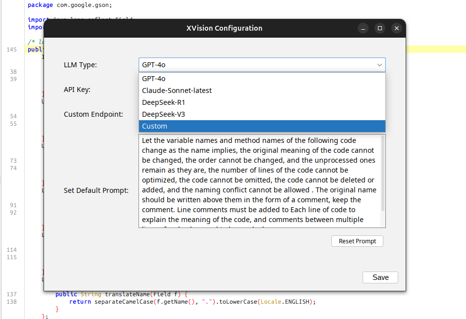

# jadX xVision Plugin

xVision is a plugin for the [JadX](https://github.com/skylot/jadx) decompiler that aims to integrate with Large Language Models (LLMs) to provide code analysis directly in the JAdX. This plugin allows you to analyze Java code for functionality, security issues, and notable patterns using LLMs like GPT-4, Claude or any custom local LLMs.

## Features

- **LLM Integration**: Supports GPT-4 & Claude-sonnet-latest, DeepSeak V3 and R1 models
- **Code Analysis**: Analyze Java code for functionality, security issues, and notable patterns.
- **Custom Prompts**: Configure custom prompts for analysis.
- **GUI Integration**: Integrates with JadX GUI for easy access.

## Screenshots




## Installation

### Prerequisites

- JadX v1.5.0 or later (CLI or GUI)
- Java Development Kit (JDK) 11 or higher

### Download the jar file from releases

- [jadX-xVision Plugin v1.1.0](https://github.com/samanl33t/jadx-xvision-plugin/releases/download/v1.0.0/jadx-xvision-plugin_v1.1.0.jar)

### Build locally

1. **Clone the repository**:
    ```sh
    git clone https://github.com/samanl33t/jadx-xvision-plugin.git
    cd jadx-xvision-plugin
    ```

2. **Build the plugin**:
    ```sh
    ./gradlew clean build
    ```

3. **Install the plugin**:
    - For `jadx-cli`:
        ```sh
        jadx plugins --install-jar build/libs/jadx-xVision-plugin-dev.jar
        ```
    - For `jadx-gui`:
        - Open JadX GUI.
        - Go to **Plugins** > **Install plugin**.
        - Select the `jadx-xVision-plugin-dev.jar` file from the `build/libs` directory.

## Usage

### JadX GUI

1. **Open JadX GUI**.
2. **Load a supported package to analyze**.
3. **Click Menu -> 'Xvision Config'** - Select LLM to use and add **API Key**
4. **Right-click on a class or method** and select **Analyze with xVision Plugin**.

### Configuration

The Plugin options can be configured from Menu bar > Plugins > xVision Config.
Following configurations are available:

- **LLM Type** Select LLM to use
- **API Key** API Key for selected LLM
- **Custom Endpoint** API endpoint if you're using a custom LLM
- **Set Default Prompt**  Replace the default prompt with your own prompt for all further analysis.

### Custom Prompts

1. **Select a code block** in JadX GUI.
2. **Right-click** and choose **Analyze with xVision Plugin**.
3. **Check the Custom Prompt checkox** in the dialog that appears.
4. Enter the custom prompt to use.

>Note: The custom prompt will replace the default prompt


## Thanks
- [MartinKayJr](https://github.com/skylot/jadx/issues/1884#issue-1727047157) - for default prompt.
- [Devilx86](https://github.com/Devilx86/jadx-ai-view-plugin) - LLM response Code Rendering in a new window.
- bobbylight [RSyntaxTextArea](https://github.com/bobbylight/RSyntaxTextArea)


## Contributing

Contributions are welcome! Please open an issue or submit a pull request on GitHub.
